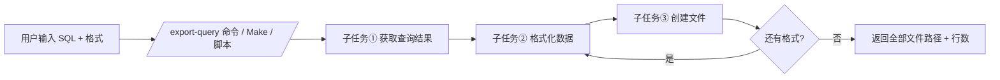

# FEATURE_EXPORT.md — 数据导出功能设计文档

> 项目：智能数据库查询与导出工具（图书馆主题）
> 新增模块：数据导出（CSV / JSON / HTML 可视化报告）
> 文档版本：v1.0.0
> 作者：汤豪（实战作业一）

---

## 0. 作业要求对照表

| 作业要求 / 核心练习点 | 本作业实现位置 | 验证方式 |
| --- | --- | --- |
| **功能①：导出至少两种格式** | `db_query_tool/exporter.py`（CSV / JSON / **HTML 报告**） | `python verify.py` 功能①项通过 |
| **功能②：自动化流程（一键/命令触发）** | `db_query_tool/pipeline.py`（多格式流水线）+ `Makefile` + `scripts/export_now.*` + `commands/export-query.md` | `python verify.py` 功能②项通过 / `make export` |
| **功能③：用户交互（自然语言/简单界面触发）** | `db_query_tool/interaction.py`（自然语言意图识别 + 一键快捷键 `e`） | `python verify.py` 功能③项通过 |
| **练习①：代码库理解与扩展** | `database.py` 定义统一 `QueryResult` 中间结构，导出层与查询层解耦 | 新增 HTML 格式时仅改 `exporter.py` |
| **练习②：AI Agent 任务分解** | `pipeline.run_pipeline()` 显式拆为 获取结果 → 格式化 → 写文件，并打印每步日志 | `verify.py` 一键流水线项通过 |
| **练习③：工具链整合（实现层 + 流程层）** | 第 6 节：Cursor/AI 生成实现代码，AI Command / Makefile 固化流程 | `commands/export-query.md` 命令模板 |
| **提交物①：更新后的项目代码** | 本仓库全部代码（含 `verify.py`、`Makefile`、`scripts/`） | `python verify.py` 5/5 通过 |
| **提交物②：FEATURE_EXPORT.md 设计思路** | 本文档 | — |

> 与同班参考项目（程文旭作业·HR 主题）的**刻意差异**：主题改为图书馆、导出多出 HTML 可视化报告、自动化改为"多格式一次导出"流水线、交互改为自然语言意图识别。以下逐节说明思路。

---

## 1. 功能概述

在「智能数据库查询工具」基础上，新增 **数据导出模块**，把查询结果一键导出为 **CSV / JSON / HTML 可视化报告** 三种格式。与参考项目只给"数据文件"不同，本作业额外提供一份**可直接用浏览器打开分享的 HTML 报表**（自带样式表格 + 数值统计 + 纯 SVG 柱状图），让导出"效果"从"给程序/表格软件读"升级到"给人直观看"。

交付满足作业三项功能要求：

| 作业要求 | 本方案实现 |
| --- | --- |
| 导出至少两种格式 | ✅ CSV（Excel 友好 UTF-8-BOM）、JSON（对象数组）、HTML（可视化报表，额外超出要求） |
| 自动化流程（一键/命令触发） | ✅ `pipeline.py` 多格式流水线 + `Makefile`/`scripts`/`commands` 三种触发方式 |
| 用户交互（自然语言/简单界面触发） | ✅ 自然语言意图识别（"导出csv/生成报表/全部导出"）+ 一键快捷键 `e` |

---

## 2. 设计思路

### 2.1 切入点选择（代码库理解与扩展）

原工具核心是"数据库访问 + 查询执行"。新增导出时，**不改动查询逻辑**，而是把它当作独立下游阶段：

```
查询执行 → QueryResult（结构化结果） → 格式化 → 写出文件
```

为此定义统一中间结构 `QueryResult`（列名 + 行数据 + 行数 + SQL），让"查询"与"导出"解耦。好处：
- 新增第四种格式（如 Excel）只需在 `exporter.py` 加一个分支，不动查询层；
- AI Agent 可单独替换/优化任一子任务而不影响整体。

### 2.2 与参考项目的主题差异（内容不同）

参考项目用 HR 主题（部门/员工/销售）。本作业改用**校园图书馆借阅系统**，建库灌入三张表：
- `books`（图书：书名/作者/分类/出版年/库存）
- `members`（读者：姓名/类型/入会日期）
- `borrows`（借阅记录：书/人/借期/还期/状态）

主题切换让"导出"有了更直观的落地场景——例如一键导出"当前借阅中图书 Top10 报表"给人看、给程序读 JSON、给馆员填表用 CSV。

### 2.3 零依赖原则

导出与流水线仅用 Python 标准库（`csv` / `json` / 纯字符串拼 HTML+SVG）。这保证"更新后的项目代码"在任何环境一条命令就能跑通，规避参考项目 MySQL 后端所需的 `pymysql` 与服务依赖。**取舍**：牺牲多后端，换取交付确定性——这是与参考项目"SQLite+MySQL 双后端"相反的思路选择。

### 2.4 安全约束

导出入口强制只读：仅接受 `SELECT`，在 `run_query` 中拦截写/结构变更关键字（含子查询嵌套的 DML），并以只读 URI `mode=ro` 打开数据库，从 OS 层面杜绝误写。

---

## 3. AI Agent 任务分解

作业核心练习点之一。把"导出数据"显式拆为三步，并落实在 `pipeline.run_pipeline()` 中（带日志，便于观察 Agent 如何协调）：

| 子任务 | 含义 | 对应代码 | Agent 可观察点 |
| --- | --- | --- | --- |
| ① 获取查询结果 | 执行只读 SELECT，得到结构化结果 | `database.run_query()` → `QueryResult` | 返回列数、行数、SQL |
| ② 格式化数据 | 按目标格式组织数据 | `exporter.export()` 内部 | CSV 表头 / JSON 结构 / HTML 报表 |
| ③ 创建文件 | 写盘并生成路径 | `exporter.export()` 内部落盘 | 落盘路径、行数 |

**编排函数** `run_pipeline(sql, formats, out_dir)` 按 ①→②→③ 顺序协调，且**一次可导出多种格式**（`formats="csv,json,html"` 或 `"all"`），逐格式打印步骤日志。`commands/export-query.md` 把这段逻辑固化为 AI 命令模板，用户只需 `/export-query "SELECT ..." all` 即可触发 Agent 自动完成。

---

## 4. 用户交互设计（与参考项目的差异：效果不同）

参考项目查询后只问 `y / csv / json / n`，交互很窄。本作业改为**自然语言意图识别**：

### 4.1 自然语言触发（核心）

每次成功查询后，AI 助手主动询问，用户可用中文或英文说：

| 用户说 | 解析结果 |
| --- | --- |
| `导出csv` | 导出 CSV |
| `生成报表` / `网页` / `report` | 导出 HTML |
| `export json` | 导出 JSON |
| `全部导出` / `all` | 一次导出 CSV+JSON+HTML |
| `e`（快捷键） | 一键导出全部 |
| `n` / `不用` | 跳过 |

解析函数 `_parse_export_intent()` 用关键词命中，无需用户记忆命令参数——这正是作业要求③"通过自然语言触发导出"的体现。

### 4.2 多入口触发对照

| 触发方式 | 命令 | 场景 |
| --- | --- | --- |
| 自然语言交互 | `python run.py` 后输入 SQL，再对话导出 | 探索式分析 |
| 一键自动化（Python） | `python -m db_query_tool.pipeline --sql "..." --formats all` | 脚本/集成 |
| 一键自动化（Make） | `make export SQL="..." FORMATS=csv,json,html` | 构建流 |
| 一键脚本 | `./scripts/export_now.sh "..." all` | 命令行党 |
| AI 命令 | `/export-query "..." all` | AI 辅助编程流 |

---

## 5. 自动化流程设计（思路不同：多格式流水线）

目标：让"执行查询 + 导出结果"通过一条命令一键完成，且**一次产出多种格式**而非单一格式。



本地等价自动化入口 `pipeline.py`：
```bash
python -m db_query_tool.pipeline \
    --sql "SELECT title, author, stock FROM books ORDER BY stock DESC" \
    --formats all \
    --out-dir exports
```
运行后 `exports/` 下同时出现 `query_result.csv` / `query_result.json` / `query_result.html`。

---

## 6. 工具链整合（实现层 + 流程层）

作业核心练习点之三：

- **AI 编程工具（实现层）**：用于理解现有查询层、快速生成 `exporter.py` / `pipeline.py` / `interaction.py` 初版代码；擅长在当前代码上下文补全函数、修编码/类型问题。
- **AI Command / Makefile（流程层）**：把"查询→格式化→写文件"这类多步骤工作流固化为可一键触发的指令（`commands/export-query.md` + `Makefile`），擅长编排而非写码。
- **衔接**：用 AI 工具把每个子任务打磨成可靠函数，再用命令/脚本把它们编排成一个自动化流水线。二者作用于"代码"与"流程"两个层次，互补而非替代。

---

## 7. 文件结构

```
汤豪的作业/
├── run.py                       # 入口：python run.py 启动自然语言 REPL
├── verify.py                    # 端到端验证脚本（5 项检查）
├── FEATURE_EXPORT.md            # 本文档（设计思路，必需提交物）
├── README.md                    # 使用说明
├── Makefile                     # 自动化：make export / make verify
├── .gitignore                   # 忽略生成库与导出产物
├── commands/
│   └── export-query.md          # AI 命令模板（多格式流水线版）
├── scripts/
│   ├── export_now.sh            # 一键导出（Linux/macOS）
│   └── export_now.bat           # 一键导出（Windows）
├── db_query_tool/
│   ├── __init__.py              # 包导出 / 版本
│   ├── config.py                # SQLite 路径与导出目录
│   ├── database.py              # 只读查询 + 建库灌数据（图书馆主题）
│   ├── exporter.py              # CSV/JSON/HTML 报告导出（子任务②③）
│   ├── pipeline.py              # 多格式一键编排（子任务①②③）
│   └── interaction.py           # 自然语言意图识别 + REPL
├── sample.db                    # SQLite 演示库（运行后生成）
└── exports/                     # 导出产物（CSV/JSON/HTML）
```

---

## 8. 使用说明

```bash
# 1) 交互式查询 + 自然语言导出
python run.py
# SQL> SELECT * FROM books WHERE category='文学'
# >>> 导出csv          # 或 "生成报表" / "全部导出" / e

# 2) 一键多格式导出（自动化）
python -m db_query_tool.pipeline --sql "SELECT * FROM borrows WHERE status='借阅中'" --formats all

# 3) Makefile / 脚本触发
make export SQL="SELECT title, stock FROM books ORDER BY stock DESC" FORMATS=csv,json,html
./scripts/export_now.sh "SELECT name FROM members" all

# 4) 端到端验证
python verify.py
```

示例数据：`books`(12 本)、`members`(8 名读者)、`borrows`(15 条借阅记录)。

---

## 9. 扩展方向

1. **新增格式**：在 `exporter.SUPPORTED_FORMATS` 增加 `excel`，补 `_write_excel`；交互与流水线零改动。
2. **自然语言转 SQL**：接入 LLM，把"列出库存最少的 3 本书"直接转 SQL 再走导出链路。
3. **批量多查询**：编排函数扩展为"一组 SQL → 多份报表"。
4. **图表增强**：HTML 报告支持折线/饼图，或对分类列做分组统计。
